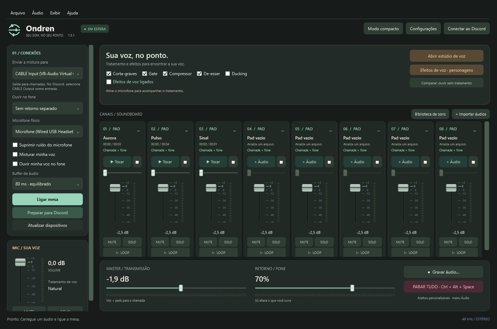

# Ondren
**Seu som, no seu ponto.** Mesa de áudio para Windows, com tratamento de voz, efeitos e oito pads para compartilhar sons em chamadas.

**[Visite o site oficial do Ondren — ondren.pages.dev](https://ondren.pages.dev)**

## Baixar a beta gratuita
**[Baixar Ondren para Windows 64 bits](https://github.com/GAXX31/ondren/releases/download/v1.5.1-beta.1/Ondren-1.5.1-beta.1-Windows-x64.zip)** · [Notas e arquivos da versão](https://github.com/GAXX31/ondren/releases/tag/v1.5.1-beta.1)

Versão do aplicativo: **1.5.1**. Primeira distribuição pública: **beta 1**. Extraia a pasta inteira e abra `Ondren.exe`. O .NET necessário já acompanha o aplicativo.

## O que você pode fazer
- Tratar a voz com supressão de ruído local, equalização, gate, compressor e de-esser.
- Explorar mudança de tom, eco, reverberação, rádio e personagens.
- Usar oito pads com atalhos, biblioteca, prévia no fone e destinos e volumes separados.
- Cortar áudios, remover silêncio inicial, aplicar fades e salvar uma nova cópia.
- Gravar a mistura ou três faixas sincronizadas: mistura, voz tratada e soma dos pads.
- Exportar cenas com seus áudios e usar o modo compacto ou a bandeja do Windows.

## Primeiros passos
1. Baixe o ZIP e escolha **Extrair tudo** no Windows.
2. Abra `Ondren.exe`. Mantenha `Assets`, `Native` e `Licencas` junto dele.
3. Selecione seu microfone físico e seu fone. O app inicia com a mesa desligada.
4. Para levar a mistura ao Discord, configure um dispositivo virtual como o [VB-CABLE oficial](https://vb-audio.com/Cable/), instalado separadamente.
5. No Ondren, envie para **CABLE Input**. No Discord, selecione **CABLE Output** como entrada e o fone físico como saída.
6. Ligue a mesa quando estiver pronto. Para transmitir sua voz, marque **Misturar minha voz**.

O VB-CABLE é um produto independente da VB-Audio e não acompanha o pacote. Consulte as condições do fabricante.

## Sobre esta beta
A beta é gratuita para experimentar e enviar comentários. O código-fonte do Ondren é mantido em um repositório privado; este repositório reúne a distribuição, a documentação e os relatos de problemas. As licenças das bibliotecas de terceiros acompanham o aplicativo.

O executável ainda não tem assinatura digital de editor. O Windows pode apresentar um aviso de aplicativo desconhecido. A hospedagem no GitHub não representa certificação da Microsoft; mantenha as proteções do Windows ativas.

A versão passou por 156 testes automatizados de áudio e arquivos, além de verificações de interface. Isso não substitui testes em diferentes computadores e dispositivos. Consulte [as perguntas frequentes](FAQ.md).

## Participar
[Relatar um problema](https://github.com/GAXX31/ondren/issues/new?template=problema.yml) · [Sugerir uma melhoria](https://github.com/GAXX31/ondren/issues/new?template=sugestao.yml) · [Histórico de atualizações](NOVIDADES.md)

Ao enviar um relato, evite incluir dados pessoais, gravações de chamadas ou arquivos de configuração completos.
